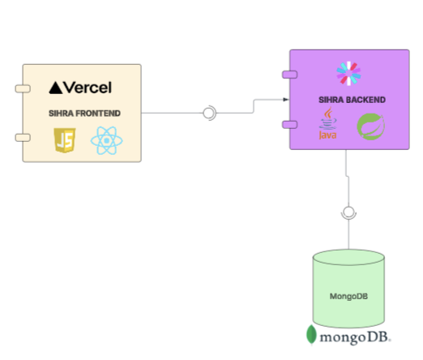
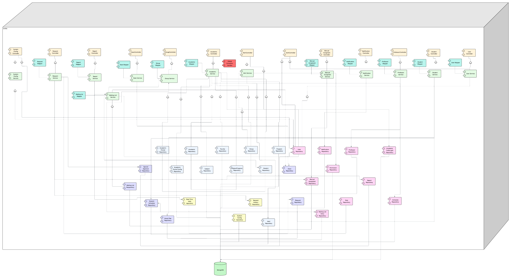
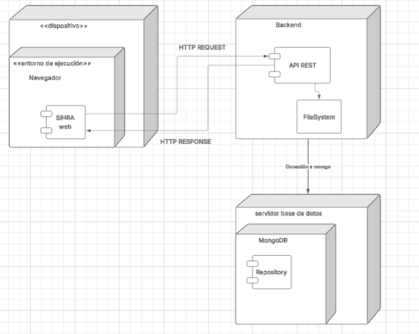
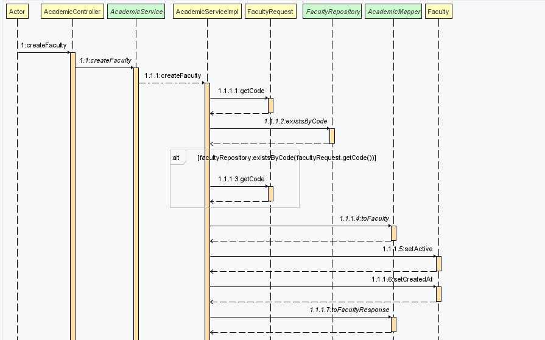
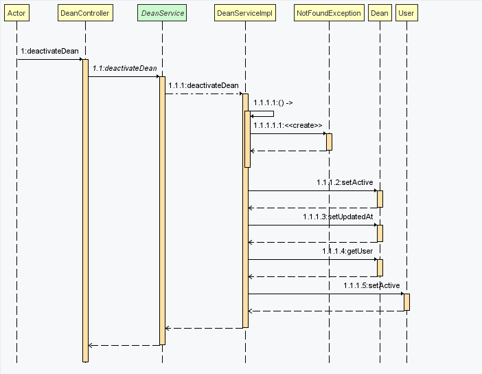
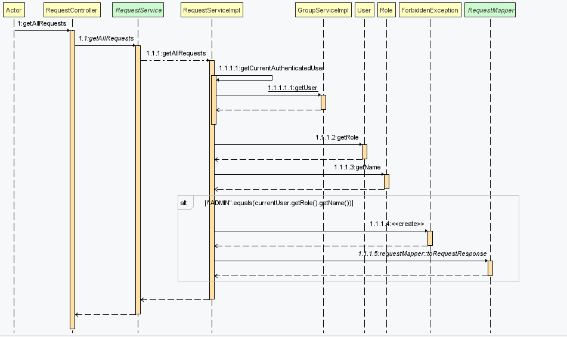
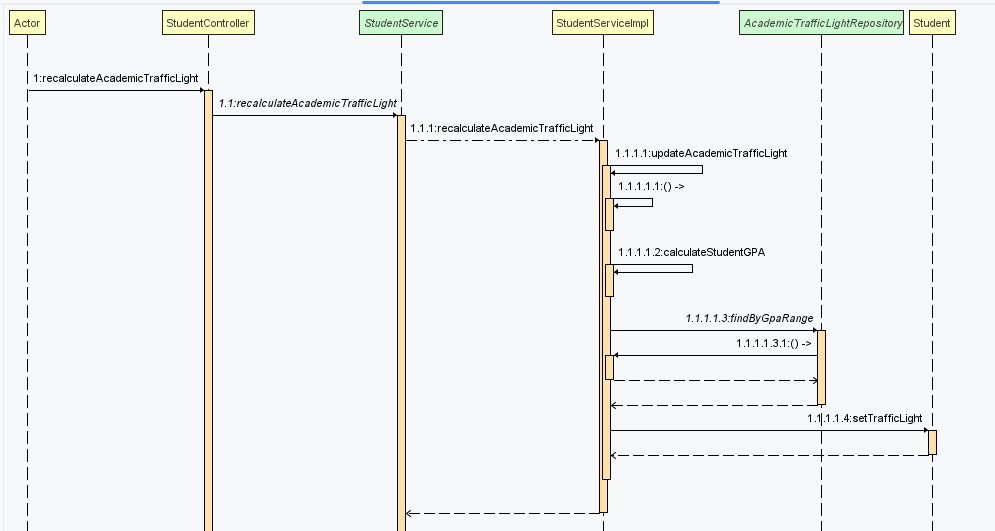
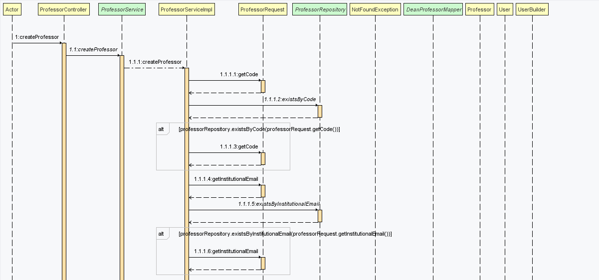
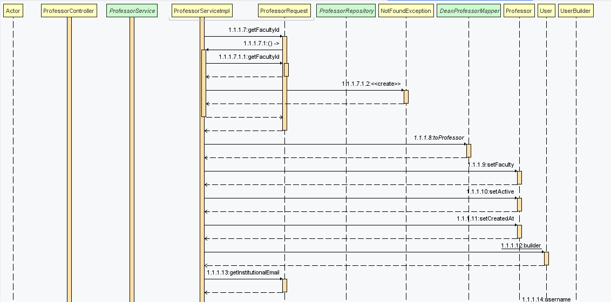

# 🎓 SIRHA - Sistema de Reasignación de Horarios Académicos

> Sistema de Gestión Académica desarrollado por el equipo CHICAS-SUPERPODEROSAS

---

## 👥 Integrantes del Proyecto

| Nombre | Rol |
|--------|-----|
| **Valeria Bermúdez Aguilar** | Desarrolladora |
| **Juan Andrés Suárez Fonseca** | Desarrollador |
| **Carlos David Astudillo Castiblanco** | Desarrollador |
| **Ana Gabriela Fiquitiva Poveda** | Desarrolladora |

---

## 🔗 Enlaces del Proyecto

### 📦 Repositorio
- **BackEnd**: [GitHub Repository](https://github.com/AnaFiquitiva/CHICAS-SUPERPODEROSAS-_BACK.git)

### 📊 Gestión de Proyecto
- **Tablero Jira**: [Ver Tablero](https://lc5.atlassian.net/jira/software/projects/SCRUM/boards/1/backlog)

### 📄 Documentación
- **Documento de Requerimientos**: [Ver Documento](https://docs.google.com/document/d/1QQTtvrpe3ckFsEVrEOXLoOOKtfOTOchyWGx3rIJgM5g/edit)
- **Documento de Arquitectura Back**: [Ver Documento](https://docs.google.com/document/d/1qRB4X-avn5bgg7-FGpukmTu5wqMt_NLhz4XO49avYmM/edit)

### 🔌 API Documentation
- **Swagger UI**: [Ver API en Swagger](https://sirhaapp12345.azurewebsites.net/swagger-ui/index.html#/)
    - Documentación interactiva de todos los endpoints
    - Pruebas en tiempo real de la API
    - Especificaciones detalladas de requests y responses

---

## 📐 Diagramas UML

### 🌐 Diagrama de Contexto


#### Componentes Principales:

**🏛️ SIRHA** - Núcleo Central
- Plataforma tecnológica principal
- Gestión de lógica de reasignación de horarios
- Coordinación de procesos académicos integrados

**👨‍🎓 Estudiantes** - Usuarios Finales
- Radican solicitudes de cambios académicos
- Consultan estados de trámites en proceso
- Flujo inicial de entrada de solicitudes al sistema

**👔 Decanatura** - Autoridad Académica
- Evalúan solicitudes mediante proceso de revisión
- Aprueban o rechazan solicitudes académicas
- Toman decisiones basadas en criterios institucionales

**🔧 Personal Administrativo** - Soporte Operativo
- Gestionan usuarios del sistema
- Generan reportes operativos y estadísticos
- Proporcionan análisis para la gestión institucional

#### 🔄 Flujo de Trabajo Integrado:

La arquitectura refleja un **flujo de trabajo claro** donde:
1. Las **solicitudes se originan** desde los estudiantes
2. **Pasan por evaluación** de la decanatura
3. **Son apoyadas** por funciones administrativas
4. **Todo se sustenta** en la plataforma SIRHA unificada


---

### 🏗️ Diagrama de Clases


---

## 🎨 Patrones de Diseño Implementados

### 1. 🔨 Builder Pattern

Consistente en la creación de objetos complejos mediante un enfoque paso a paso.

**¿Por qué se implementó?**
- Para evitar constructores telescópicos con múltiples parámetros
- Para permitir la creación flexible de objetos sin exponer lógica compleja
- Para mejorar la legibilidad del código al construir objetos con muchos atributos

**Ejemplo:**
```java
// Student.java
@Builder
public class Student {
    private String code;
    private String firstName;
    private String lastName;
    private Program program;
}

// Uso en servicios:
Student student = Student.builder()
    .code("2024001")
    .firstName("Ana")
    .lastName("García")
    .program(program)
    .build();
```

---

### 2. 📚 Repository Pattern

Patrón que abstrae el acceso a datos, proporcionando una interfaz clara para las operaciones CRUD.

**¿Por qué se implementó?**
- Para separar la lógica de negocio del acceso a datos
- Para facilitar el testing mediante mocking de repositorios
- Para centralizar y estandarizar las operaciones de base de datos

**Ejemplo:**
```java
// Entidad con anotación de Spring Data MongoDB
@Document(collection = "students")
public class Student {
    @Id 
    private String id;
    private String code;
    private String firstName;
}

// Spring genera automáticamente el repositorio
public interface StudentRepository extends MongoRepository<Student, String> {
    Optional<Student> findByCode(String code);
    List<Student> findByProgram(Program program);
}
```

---

### 3. 🔄 State Pattern

Permite a un objeto alterar su comportamiento cuando su estado interno cambia.

**¿Por qué se implementó?**
- Para gestionar transiciones de estado de manera controlada y predecible
- Para eliminar complejas condiciones `if/else` en el manejo de estados
- Para facilitar la adición de nuevos estados sin modificar código existente

**Ejemplo:**
```java
// RequestStatus.java - Estados de solicitud
public enum RequestStatus {
    PENDING,           // Estado inicial
    UNDER_REVIEW,      // En proceso de revisión
    APPROVED,          // Aprobada
    REJECTED,          // Rechazada
    CANCELLED          // Cancelada por el usuario
}

// Uso en la entidad Request
public class Request {
    private RequestStatus status;
    
    public void approve() {
        if (this.status == RequestStatus.UNDER_REVIEW) {
            this.status = RequestStatus.APPROVED;
        }
    }
}
```

---

### 4. 🎯 Strategy Pattern

Define una familia de algoritmos, los encapsula y los hace intercambiables.

**¿Por qué se implementó?**
- Para permitir la selección de algoritmos en tiempo de ejecución
- Para evitar largas cadenas de condicionales
- Para facilitar la extensión con nuevos comportamientos

**Ejemplo:**
```java
// SubjectProgress.java - Estrategias para color de semáforo
public String getTrafficLightColor() {
    return switch (status) {
        case "PENDING" -> "GRAY";      // Estrategia para materia pendiente
        case "IN_PROGRESS" -> "YELLOW"; // Estrategia para materia en curso
        case "APPROVED" -> "GREEN";    // Estrategia para materia aprobada
        case "FAILED" -> "RED";        // Estrategia para materia reprobada
        default -> "GRAY";             // Estrategia por defecto
    };
}
```

---

### 5. 📋 Template Method Pattern

Define el esqueleto de un algoritmo en una operación, delegando algunos pasos a las subclases.

**¿Por qué se implementó?**
- Para reutilizar código común entre diferentes algoritmos
- Para permitir variaciones en implementaciones específicas
- Para establecer una estructura común que garantice consistencia

**Ejemplo:**
```java
// Group.java - Plantilla para cálculo de ocupación
public Double getOccupancyPercentage() {
    // Paso 1: Validación de capacidad (común a todos los cálculos)
    if (maxCapacity == null || maxCapacity <= 0) {
        return 0.0;
    }
    // Paso 2: Cálculo específico (puede variar)
    return (currentEnrollment.doubleValue() / maxCapacity.doubleValue()) * 100;
}

// Método que usa la plantilla
public boolean shouldTrigger90PercentAlert() {
    return getOccupancyPercentage() >= 90.0;
}
```

---

## 🧩 Principios SOLID Implementados

### 1. ✨ SRP - Single Responsibility Principle

Principio que establece que una clase debe tener una sola razón para cambiar.

**¿Por qué se implementó?**
- Para mantener clases cohesivas y enfocadas en una única responsabilidad
- Para facilitar el mantenimiento y la modificación del código
- Para reducir el acoplamiento entre diferentes funcionalidades

**Ejemplo:**
```java
// Notification.java - Responsabilidad única: gestionar notificaciones
public class Notification {
    private String title;
    private String message;
    private boolean read;
    
    // Solo métodos relacionados con notificaciones
    public void markAsRead() {
        this.read = true;
        this.readAt = LocalDateTime.now();
    }
}
```

---

### 2. 🔓 OCP - Open/Closed Principle

Principio que establece que las entidades deben estar abiertas para extensión pero cerradas para modificación.

**¿Por qué se implementó?**
- Para permitir agregar nuevas funcionalidades sin modificar código existente
- Para reducir el riesgo de introducir bugs en código probado
- Para crear un sistema más mantenible y extensible

**Ejemplo:**
```java
// AlertType.java - Extensible sin modificar código existente
public enum AlertType {
    GROUP_CAPACITY_90,    // Alerta existente
    GROUP_FULL,           // Alerta existente
    ACADEMIC_PROGRESS,    // Alerta existente
    // Se puede agregar: LOW_PERFORMANCE_ALERT sin romper código
}
```

---

### 3. 🔄 LSP - Liskov Substitution Principle

Principio que establece que los objetos de un programa deben ser reemplazables por instancias de sus subtipos sin alterar el correcto funcionamiento.

**¿Por qué se implementó?**
- Para garantizar que las jerarquías de herencia sean lógicas y consistentes
- Para permitir el polimorfismo sin sorpresas en el comportamiento
- Para crear relaciones entre clases que sean semánticamente correctas

**Ejemplo:**
```java
// User.java - Clase base con comportamiento común
public class User {
    private String username;
    private String password;
    
    public boolean authenticate(String password) {
        return this.password.equals(password);
    }
}

// Student.java - Puede sustituir a User manteniendo comportamiento
public class Student {
    @DBRef
    private User user;
    
    public String getUsername() {
        return user.getUsername();
    }
}
```

---

### 4. 🧩 ISP - Interface Segregation Principle

Principio que establece que muchas interfaces específicas son mejores que una interfaz general.

**¿Por qué se implementó?**
- Para evitar que las clases dependan de métodos que no usan
- Para crear contratos más específicos y claros
- Para reducir el acoplamiento entre módulos del sistema

**Ejemplo:**
```java
// Sistema de permisos granular por rol
public class Role {
    private String name; // ADMIN, DEAN, PROFESSOR, STUDENT
    
    @DBRef
    private List<Permission> permissions; // Permisos específicos
}
```

---

### 5. 🔀 DIP - Dependency Inversion Principle

Principio que establece que los módulos de alto nivel no deben depender de módulos de bajo nivel, sino de abstracciones.

**¿Por qué se implementó PARCIALMENTE?**
- Para reducir el acoplamiento entre componentes
- Para facilitar el testing y la sustitución de implementaciones
- Para crear un sistema más flexible y mantenible

**Ejemplo:**
```java
// Dependencia de abstracciones (enums)
private RequestType type;        // Abstracción
private RequestStatus status;    // Abstracción  
private AlertType alertType;     // Abstracción
```

---

## 📦 Módulos Principales del Sistema

### 🎓 Gestión Académica
- `Student.java` - Información estudiantil
- `Program.java` - Programas académicos
- `Faculty.java` - Facultades universitarias
- `Subject.java` - Materias/cátedras

### 📝 Sistema de Solicitudes
- `Request.java` - Solicitudes de cambio
- `RequestHistory.java` - Historial de cambios
- `SpecialApprovalCase.java` - Casos excepcionales

### 👥 Gestión de Grupos
- `Group.java` - Grupos académicos
- `Schedule.java` - Horarios de clase
- `WaitingList.java` - Listas de espera

### 🔔 Sistema de Alertas y Notificaciones
- `Alert.java` - Alertas del sistema
- `Notification.java` - Notificaciones a usuarios

### 📊 Reportes y Estadísticas
- `Report.java` - Reportes del sistema
- `RealTimeStats.java` - Estadísticas en tiempo real

---

## 🎭 Diagrama de Casos de Uso


### Descripción General

El **Diagrama de Casos de Uso** representa la funcionalidad completa del **Sistema de Gestión Académica**, mostrando la interacción entre los diferentes actores y los módulos principales del sistema.

### 👤 Actores Principales

#### 1. 👨‍🎓 Estudiante
- Gestiona su perfil personal
- Consulta información académica: horarios, semáforo académico y progreso
- Realiza solicitudes de cambios académicos (asignaturas, grupos, etc.)

#### 2. 👨‍🏫 Profesor
- Revisa información de grupos académicos
- Participa en el proceso de revisión de solicitudes académicas

#### 3. 👔 Decano
- Aprueba o rechaza solicitudes
- Gestiona casos excepcionales y asignaciones manuales
- Genera reportes académicos

#### 4. 🔧 Administrador
- Configura parámetros globales del sistema
- Gestiona usuarios y roles
- Supervisa la integridad y disponibilidad del sistema

#### 5. 🤖 Sistema Automático
- Monitorea el sistema de forma proactiva
- Genera alertas y notificaciones ante eventos relevantes

### 📋 Módulos Principales

1. **Gestión Estudiantil**  
   Funcionalidades relacionadas con el perfil del estudiante, su información académica y progreso.

2. **Gestión de Solicitudes**  
   Permite a los actores crear, revisar, aprobar o rechazar solicitudes académicas.
    - Incluye el manejo automático de listas de espera.

3. **Gestión de Grupos**  
   Facilita la administración de grupos académicos, su composición y asignación de profesores.

4. **Asignaciones Manuales**  
   Módulo reservado para el decano, quien puede intervenir manualmente en casos especiales.

5. **Aprobaciones Especiales**  
   Procesa situaciones académicas que requieren evaluación fuera de los flujos regulares.

6. **Sistema de Alertas**  
   Supervisa indicadores académicos y administrativos, generando alertas en tiempo real.
    - Extiende funcionalidades del monitoreo del sistema automático.

7. **Sistema de Reportes**  
   Permite generar informes detallados sobre el estado académico, solicitudes, grupos y rendimiento.

8. **Configuración del Sistema**  
   Administrado por el usuario **Administrador**, define parámetros globales, usuarios, roles y permisos.

### 🔗 Relaciones Entre Casos de Uso

- **Inclusión (`<<include>>`)**:  
  Algunos casos de uso se ejecutan siempre junto con otros.  
  *Ejemplo:* la *Gestión de Solicitudes* incluye el *Manejo de Listas de Espera*.

- **Extensión (`<<extend>>`)**:  
  Determinadas funcionalidades se activan solo bajo ciertas condiciones.  
  *Ejemplo:* el *Monitoreo de Capacidad* extiende el caso de uso *Generar Alerta* cuando se supera el umbral de carga.

---

## 🏗️ Arquitectura del Sistema

### Diagrama de Componentes General



#### Arquitectura de Despliegue SIRHA

El sistema SIRHA está estructurado bajo una **arquitectura de tres capas** que utiliza tecnologías especializadas para cada componente:

- **Frontend en Vercel**: Se despliega en Vercel, aprovechando sus capacidades de distribución global y despliegue continuo para ofrecer una interfaz de usuario rápida y accesible.

- **Backend en Java**: Desarrollado en Java, se encarga de gestionar la lógica de negocio y procesar las solicitudes académicas a través de una API RESTful robusta.

- **Base de Datos MongoDB**: Proporciona la flexibilidad necesaria para manejar la información académica con su enfoque documental NoSQL, asegurando un alto rendimiento en las operaciones.

---

### Diagrama de Componentes Específico



La arquitectura está estructurada en **cuatro capas principales**:

#### 1. 🎨 Capa de Presentación (Controllers)

Esta capa define los **puntos de entrada del sistema**, gestionando las solicitudes HTTP provenientes de los distintos actores (Estudiante, Decanatura, Personal Administrativo y Sistema Automático).

**Componentes principales:**
- `SystemController` - Gestiona el estado general del sistema y las operaciones de configuración global
- `RequestController` - Maneja la creación, validación y seguimiento de solicitudes académicas
- `ReportController` - Facilita la generación y consulta de reportes académicos y administrativos
- `GroupController` - Administra las operaciones relacionadas con grupos académicos y su composición
- `AcademicController` - Expone funcionalidades de consulta académica y validación de disponibilidad
- `AutoController` - Gestiona procesos automáticos como monitoreo, alertas y reasignaciones programadas
- `ManualController` - Permite al Decano ejecutar asignaciones manuales o casos excepcionales
- `NotificationController` - Administra las notificaciones internas del sistema
- `UserController` y `AuthController` - Controlan el registro, autenticación y gestión de usuarios y roles
- `StudentController`, `ProfessorController`, `LawCareerController`, etc. - Ofrecen endpoints específicos para cada perfil académico

Cada controlador delega la lógica a su respectivo servicio, asegurando un **bajo acoplamiento** entre la capa de presentación y la de negocio.

---

#### 2. ⚙️ Capa de Lógica de Negocio (Services)

La capa de **servicios** contiene la lógica central del sistema. Aquí se implementan las reglas académicas, los flujos de aprobación, y las interacciones entre los módulos.

**Componentes destacados:**
- `SystemService` - Coordina operaciones globales del sistema y tareas de inicialización
- `RequestService` - Implementa la lógica de registro, validación y enrutamiento de solicitudes
- `ReportService` - Gestiona la generación de reportes, consultas estadísticas y filtrado de datos
- `AcademicService` - Maneja la validación de horarios, disponibilidad y requisitos académicos
- `GroupService` - Controla las operaciones relacionadas con grupos, cupos y reasignaciones
- `AutoService` - Ejecuta tareas automáticas como el monitoreo de capacidad o el envío de alertas
- `ManualService` - Permite la intervención manual en procesos excepcionales o administrativos
- `NotificationService` - Envía notificaciones automáticas y personalizadas a los usuarios
- `UserService` - Administra los datos y permisos de los usuarios del sistema

Cada servicio interactúa con uno o más **repositorios** para acceder a la información persistida, y puede ser reutilizado por varios controladores.

---

#### 3. 💾 Capa de Acceso a Datos (Repositories)

Los **repositorios** encapsulan el acceso a la base de datos, ofreciendo una interfaz clara para la manipulación de entidades.

**Repositorios principales:**
- `RequestRepository` - Solicitudes académicas
- `ReportRepository` - Datos de reportes y métricas
- `StudentRepository` - Información de estudiantes
- `FacultyRepository` - Facultades y programas académicos
- `GroupRepository` - Grupos y asignaciones
- `ProgramRepository` - Planes de estudio
- `AcademicRepository` - Información académica institucional
- `NotificationRepository` - Notificaciones generadas por el sistema
- `UserRepository` - Gestión de usuarios y roles
- `AutoRequestRepository`, `SpecialApprovalRepository`, `HistoryLogRepository` - Entidades auxiliares de seguimiento y automatización
- `FinalTimeRepository`, `ReviewRepository`, `AlertRepository` - Complementan la trazabilidad del flujo de procesos

Cada repositorio se comunica directamente con la base de datos, permitiendo la **persistencia y recuperación eficiente** de la información.

---

#### 4. 🗄️ Capa de Persistencia (Base de Datos)

El sistema utiliza **MongoDB** como motor de persistencia:

**MongoDB**  
Almacena las colecciones de datos estructuradas en documentos JSON, lo que permite un modelo flexible y eficiente para el manejo de información académica, solicitudes y registros históricos.

La conexión entre los repositorios y MongoDB está optimizada para soportar **consultas complejas**, **alta concurrencia** y **transacciones distribuidas** cuando sea necesario.

---

### 🔄 Flujo de Interacción

1. Un **usuario** (por ejemplo, un estudiante) realiza una acción a través de un **Controller** (p. ej., `RequestController`)
2. El **Controller** delega la solicitud al **Service** correspondiente (`RequestService`), donde se ejecuta la lógica de negocio
3. El **Service** consulta o actualiza la información utilizando uno o varios **Repositories**
4. Los **Repositories** interactúan con la **base de datos MongoDB**, obteniendo o persistiendo la información necesaria
5. El resultado se devuelve al **Service**, luego al **Controller**, y finalmente al **usuario o proceso automático**

---

## 🗃️ Diagrama de Base de Datos

[Ver Diagrama de Bases de Datos (PDF)](docs/uml/DiagramadeBasesdeDatos.pdf)

### 1. Estructura General del Modelo

El modelo está organizado en tres niveles conceptuales:

1. **Entidades de Usuario:** representan los distintos tipos de actores del sistema
2. **Entidades de Proceso Académico:** modelan las solicitudes y su relación con materias y grupos
3. **Capa de Persistencia (Documentos):** define cómo las entidades se almacenan en la base de datos

---

### 2. Entidades Principales

#### 👤 Usuario
Clase base de la jerarquía de actores.  
Contiene los atributos y comportamientos comunes a todos los tipos de usuarios, como:
- Identificación y credenciales
- Información personal
- Roles y permisos

#### 👨‍🎓 Estudiante
Subclase de `Usuario`.  
Representa a los estudiantes del sistema y está directamente relacionada con el flujo de solicitudes académicas.
- Puede generar una o más instancias de `SolicitudCambio`
- Se asocia con `Historial`, donde se registran sus cambios y acciones previas

#### 👔 Decanatura
Subclase de `Usuario` con privilegios de revisión académica.
- Tiene la capacidad de evaluar, aprobar o rechazar las solicitudes
- Está asociada con la entidad `SolicitudCambio` para acceder y modificar su estado

#### 🔧 Administrador
Subclase de `Usuario` con privilegios de gestión operativa.
- Supervisa la creación de usuarios y configuraciones del sistema
- Puede intervenir en el proceso de solicitudes como apoyo institucional

#### 📜 Historial
Entidad asociada a `Usuario` (y, por extensión, a `Estudiante`), encargada de mantener un registro detallado de las acciones, solicitudes y decisiones tomadas dentro del sistema.
- Permite la trazabilidad completa del flujo académico y administrativo

---

### 3. Entidades de Proceso Académico

#### 📝 SolicitudCambio
Elemento central del modelo.  
Representa las solicitudes académicas de cambio de grupo o asignatura que los estudiantes envían a la decanatura.

**Relaciones:**
- Composición con `Estudiante` (una solicitud pertenece a un estudiante)
- Asociación con `Decanatura` (la solicitud es evaluada por la autoridad académica)
- Asociación con `Materia` (indica la asignatura sobre la cual se solicita el cambio)

**Atributos típicos:**
- Identificador único
- Fecha de creación y estado actual (pendiente, aprobada, rechazada)
- Motivo del cambio y observaciones

Esta clase constituye el **núcleo del flujo de negocio** del sistema.

#### 📚 Materia
Representa una asignatura académica del plan de estudios.
- Cada `SolicitudCambio` se vincula a una `Materia` específica
- Las materias están compuestas por uno o más `Grupos`

#### 👥 Grupo
Entidad que modela las secciones o grupos asociados a una materia.
- Cada `Grupo` pertenece a una única `Materia`
- Incluye atributos como código, cupo máximo, horario y profesor asignado

---

### 4. Capa de Persistencia

La parte inferior del diagrama muestra los **documentos de almacenamiento en MongoDB**, representados como archivos verdes (`Usuario`, `SolicitudCambio`, `Materia`, `Grupo`).

**Documentos principales:**
- **Usuario:** Almacena la información de todos los tipos de usuario con diferenciación por rol
- **SolicitudCambio:** Guarda las solicitudes junto con su estado y referencias a estudiante, decanatura y materia
- **Materia:** Define las asignaturas activas con sus metadatos y relación con los grupos
- **Grupo:** Contiene los grupos por materia, sus horarios y disponibilidad

Esta estructura documental permite **flexibilidad en el esquema**, **consulta eficiente** y **escalabilidad horizontal**, características esenciales para un sistema académico de alta concurrencia.

---

### 5. Relaciones y Jerarquía

| Tipo de Relación | Descripción | Ejemplo |
|------------------|-------------|----------|
| **Herencia (Generalización)** | Permite que `Estudiante`, `Administrador` y `Decanatura` hereden de `Usuario` | `Estudiante ⬆ Usuario` |
| **Composición (♦)** | Indica dependencia fuerte: la existencia de una clase depende de otra | `Estudiante ♦─ SolicitudCambio` |
| **Asociación (—)** | Representa vínculos lógicos entre entidades | `Materia — Grupo`, `Decanatura — SolicitudCambio` |

---

### 6. Flujo Conceptual

1. Un **Estudiante** inicia una **SolicitudCambio** para modificar su grupo o asignatura
2. La **SolicitudCambio** se asocia con una **Materia** específica y su correspondiente **Grupo**
3. La **Decanatura** revisa la solicitud y actualiza su estado (aprobada o rechazada)
4. El **Administrador** supervisa los procesos y mantiene la integridad de los registros
5. Toda la información queda registrada en el **Historial** y persistida en la base de datos **MongoDB**

---

## 🚀 Diagrama de Despliegue



El **Sistema de Reasignación de Horarios Académicos (SIRHA)** está diseñado bajo una **arquitectura cliente-servidor** compuesta por tres capas principales:

### 1. 🌐 Capa de Presentación – Cliente Web

**Componente:** `SIRHA Web`  
**Entorno:** Navegador

Es la interfaz con la que interactúan los usuarios (estudiantes, decanatura y administradores).  
Desde aquí se envían solicitudes al servidor mediante **HTTP REQUEST**, y se reciben las respuestas correspondientes (**HTTP RESPONSE**).

**Funciones principales:**
- Enviar solicitudes de cambio académico
- Consultar materias, grupos y estados de trámite
- Mostrar notificaciones del sistema

---

### 2. ⚙️ Capa Lógica – Backend

**Componentes:**
- `API REST`
- `FileSystem`

El backend procesa todas las operaciones del sistema.  
La **API REST** gestiona las peticiones del cliente, aplica la lógica de negocio y genera las respuestas.  
El **FileSystem** se encarga del manejo de archivos o configuraciones internas del servidor.

**Funciones principales:**
- Validar usuarios y solicitudes
- Ejecutar procesos académicos de reasignación
- Comunicar los servicios con la base de datos

---

### 3. 🗄️ Capa de Persistencia – Base de Datos

**Servidor:** `MongoDB`  
**Componente asociado:** `Repository`

Esta capa almacena toda la información académica y administrativa del sistema, como usuarios, materias, grupos y solicitudes.  
Los **repositories** permiten el acceso a los datos desde el backend de forma estructurada.

**Conexión:**  
El backend se conecta a **MongoDB** mediante un **driver de conexión** que permite realizar operaciones CRUD (crear, leer, actualizar y eliminar).

---

### 4. 🔄 Flujo de Comunicación

1. El usuario interactúa con la aplicación **SIRHA Web** desde su navegador
2. Se envía una **petición HTTP** al **API REST** del backend
3. El backend procesa la solicitud y accede a la base de datos **MongoDB**
4. El resultado se devuelve al navegador como una **respuesta HTTP**

---

## 🛠️ Tecnologías y Arquitectura

### Stack Tecnológico
- **Backend:** Spring Boot 3.x
- **Base de Datos:** MongoDB
- **Build Tool:** Maven
- **Lombok:** Reducción de código boilerplate

### Arquitectura
- Patrón MVC con separación clara de responsabilidades
- Base de datos NoSQL para flexibilidad en esquemas
- API REST para comunicación frontend-backend

---

## 📈 Características Principales

### ✅ Funcionalidades Implementadas

- ✨ **Gestión de Usuarios y Roles**
    - Autenticación y autorización
    - Perfiles diferenciados por rol
    - Sistema de permisos granular

- 📝 **Sistema de Solicitudes**
    - Creación y seguimiento de solicitudes
    - Flujo de aprobación multinivel
    - Historial completo de cambios

- 👥 **Gestión de Grupos Académicos**
    - Administración de cupos
    - Control de ocupación
    - Listas de espera automáticas

- 🔔 **Sistema de Notificaciones**
    - Alertas en tiempo real
    - Notificaciones por evento
    - Panel de notificaciones personalizado

- 📊 **Reportes y Estadísticas**
    - Generación de reportes académicos
    - Estadísticas en tiempo real
    - Análisis de tendencias

- 🤖 **Automatización**
    - Monitoreo automático de capacidad
    - Alertas proactivas
    - Reasignaciones automáticas

---

## Diragramas de Secuencias







---

##  Recursos Adicionales

### Documentación Técnica
- [Spring Boot Documentation](https://spring.io/projects/spring-boot)
- [MongoDB Documentation](https://docs.mongodb.com/)
- [Maven Documentation](https://maven.apache.org/guides/)
- [Lombok Documentation](https://projectlombok.org/features/)

### Guías de Desarrollo
- Consulta el [Documento de Requerimientos](https://docs.google.com/document/d/1QQTtvrpe3ckFsEVrEOXLoOOKtfOTO