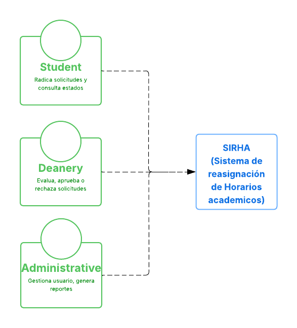
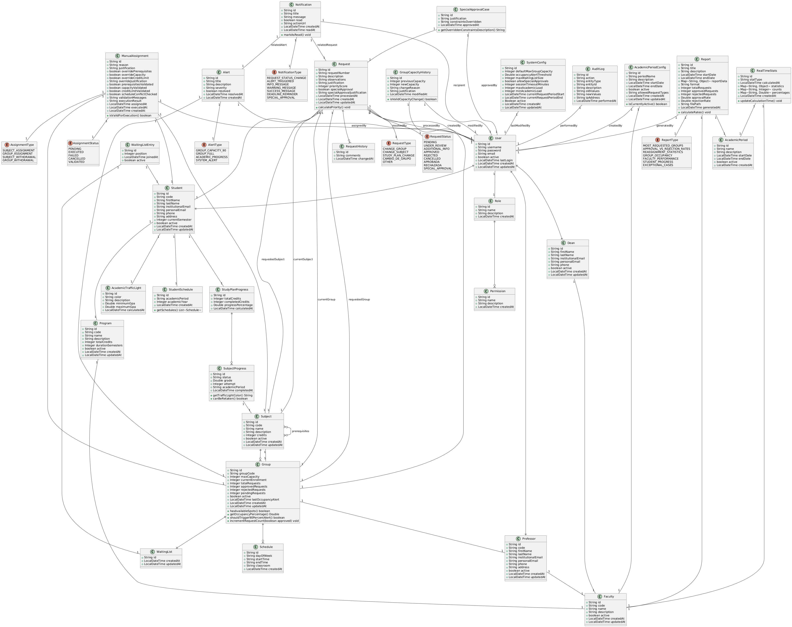
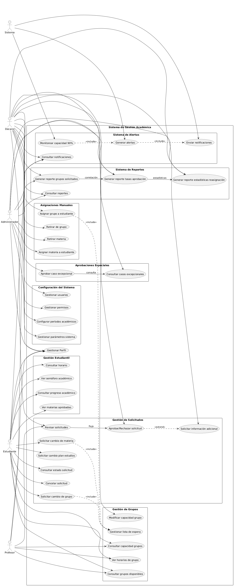

# CHICAS-SUPERPODEROSAS-_BACK

## Sistema de Gestión Académica 

###  Integrantes:
- **Valeria Bermúdez Aguilar**
- **Juan Andrés Suárez Fonseca**
- **Carlos David Astudillo Castiblanco**
- **Ana Gabriela Fiquitiva Poveda**

###  Enlaces del Proyecto

####  Repositorio
- **BackEnd**: https://github.com/AnaFiquitiva/CHICAS-SUPERPODEROSAS-_BACK.git

####  Gestión de Proyecto
- **Tablero Jira**: https://lc5.atlassian.net/jira/software/projects/SCRUM/boards/1/backlog

####  Documentación
- **Documento de Requerimientos**: https://docs.google.com/document/d/1QQTtvrpe3ckFsEVrEOXLoOOKtfOTOchyWGx3rIJgM5g/edit
- **Documento de Arquitectura Back**: https://docs.google.com/document/d/1qRB4X-avn5bgg7-FGpukmTu5wqMt_NLhz4XO49avYmM/edit

###  Diagramas UML
- **Diagrama de Contexto**
  

### Componentes Principales:

#### **SIRHA** - Núcleo Central
- **Plataforma tecnológica principal**
- **Gestión de lógica de reasignación de horarios**
- **Coordinación de procesos académicos integrados**

#### **Estudiantes** - Usuarios Finales
- **Radican solicitudes** de cambios académicos
- **Consultan estados** de trámites en proceso
- **Flujo inicial** de entrada de solicitudes al sistema

#### **Decanatura** - Autoridad Académica
- **Evalúan solicitudes** mediante proceso de revisión
- **Aprueban o rechazan** solicitudes académicas
- **Toman decisiones** basadas en criterios institucionales

#### **Personal Administrativo** - Soporte Operativo
- **Gestionan usuarios** del sistema
- **Generan reportes** operativos y estadísticos
- **Proporcionan análisis** para la gestión institucional

###  Flujo de Trabajo Integrado:
La arquitectura refleja un **flujo de trabajo claro** donde:
1. Las **solicitudes se originan** desde los estudiantes
2. **Pasan por evaluación** de la decanatura
3. **Son apoyadas** por funciones administrativas
4. **Todo se sustenta** en la plataforma SIRHA unificada

- **Diagrama de Clases**
  
## ️ PATRONES DE DISEÑO IMPLEMENTADOS

### **1. Builder Pattern**
Consistente en la creación de objetos complejos mediante un enfoque paso a paso.

**¿Por qué se implementó?**
- Para evitar constructores telescópicos con múltiples parámetros
- Para permitir la creación flexible de objetos sin exponer lógica compleja
- Para mejorar la legibilidad del código al construir objetos con muchos atributos

**Ejemplo:**
```java
// Student.java
@Builder
public class Student {
    private String code;
    private String firstName;
    private String lastName;
    private Program program;
}

// Uso en servicios:
Student student = Student.builder()
    .code("2024001")
    .firstName("Ana")
    .lastName("García")
    .program(program)
    .build();
```
## 2. Repository Pattern
Patrón que abstrae el acceso a datos, proporcionando una interfaz clara para las operaciones CRUD.

### ¿Por qué se implementó?
- Para separar la lógica de negocio del acceso a datos
- Para facilitar el testing mediante mocking de repositorios
- Para centralizar y estandarizar las operaciones de base de datos

### Ejemplo:

```java
// Entidad con anotación de Spring Data MongoDB
@Document(collection = "students")
public class Student {
    @Id 
    private String id;
    private String code;
    private String firstName;
}

// Spring genera automáticamente el repositorio
public interface StudentRepository extends MongoRepository<Student, String> {
    Optional<Student> findByCode(String code);
    List<Student> findByProgram(Program program);
}
```
## 3. State Pattern

Permite a un objeto alterar su comportamiento cuando su estado interno cambia.

### ¿Por qué se implementó?
- Para gestionar transiciones de estado de manera controlada y predecible
- Para eliminar complejas condiciones `if/else` en el manejo de estados
- Para facilitar la adición de nuevos estados sin modificar código existente

### Ejemplo:

```java
// RequestStatus.java - Estados de solicitud
public enum RequestStatus {
    PENDING,           // Estado inicial
    UNDER_REVIEW,      // En proceso de revisión
    APPROVED,          // Aprobada
    REJECTED,          // Rechazada
    CANCELLED          // Cancelada por el usuario
}

// Uso en la entidad Request
public class Request {
    private RequestStatus status;
    
    public void approve() {
        if (this.status == RequestStatus.UNDER_REVIEW) {
            this.status = RequestStatus.APPROVED;
        }
    }
}
```
## 4. Strategy Pattern

Define una familia de algoritmos, los encapsula y los hace intercambiables.

### ¿Por qué se implementó?
- Para permitir la selección de algoritmos en tiempo de ejecución
- Para evitar largas cadenas de condicionales
- Para facilitar la extensión con nuevos comportamientos

### Ejemplo:

```java
// SubjectProgress.java - Estrategias para color de semáforo
public String getTrafficLightColor() {
    return switch (status) {
        case "PENDING" -> "GRAY";      // Estrategia para materia pendiente
        case "IN_PROGRESS" -> "YELLOW"; // Estrategia para materia en curso
        case "APPROVED" -> "GREEN";    // Estrategia para materia aprobada
        case "FAILED" -> "RED";        // Estrategia para materia reprobada
        default -> "GRAY";             // Estrategia por defecto
    };
}
```
## 5. Template Method Pattern

Define el esqueleto de un algoritmo en una operación, delegando algunos pasos a las subclases.

### ¿Por qué se implementó?
- Para reutilizar código común entre diferentes algoritmos
- Para permitir variaciones en implementaciones específicas
- Para establecer una estructura común que garantice consistencia

### Ejemplo:

```java
// Group.java - Plantilla para cálculo de ocupación
public Double getOccupancyPercentage() {
    // Paso 1: Validación de capacidad (común a todos los cálculos)
    if (maxCapacity == null || maxCapacity <= 0) {
        return 0.0;
    }
    // Paso 2: Cálculo específico (puede variar)
    return (currentEnrollment.doubleValue() / maxCapacity.doubleValue()) * 100;
}

// Método que usa la plantilla
public boolean shouldTrigger90PercentAlert() {
    return getOccupancyPercentage() >= 90.0;
}
```
##  **PRINCIPIOS SOLID IMPLEMENTADOS**

### 1. SRP - Single Responsibility Principle
Principio que establece que una clase debe tener una sola razón para cambiar.

#### ¿Por qué se implementó?
- Para mantener clases cohesivas y enfocadas en una única responsabilidad
- Para facilitar el mantenimiento y la modificación del código
- Para reducir el acoplamiento entre diferentes funcionalidades

#### Ejemplo:

```java
// Notification.java - Responsabilidad única: gestionar notificaciones
public class Notification {
    private String title;
    private String message;
    private boolean read;
    
    // Solo métodos relacionados con notificaciones
    public void markAsRead() {
        this.read = true;
        this.readAt = LocalDateTime.now();
    }
}
```
### 2. OCP - Open/Closed Principle
Principio que establece que las entidades deben estar abiertas para extensión pero cerradas para modificación.

#### ¿Por qué se implementó?
- Para permitir agregar nuevas funcionalidades sin modificar código existente
- Para reducir el riesgo de introducir bugs en código probado
- Para crear un sistema más mantenible y extensible

#### Ejemplo:

```java
// AlertType.java - Extensible sin modificar código existente
public enum AlertType {
    GROUP_CAPACITY_90,    // Alerta existente
    GROUP_FULL,           // Alerta existente
    ACADEMIC_PROGRESS,    // Alerta existente
    // Se puede agregar: LOW_PERFORMANCE_ALERT sin romper código
}
```
### 3. LSP - Liskov Substitution Principle
Principio que establece que los objetos de un programa deben ser reemplazables por instancias de sus subtipos sin alterar el correcto funcionamiento.

#### ¿Por qué se implementó?
- Para garantizar que las jerarquías de herencia sean lógicas y consistentes
- Para permitir el polimorfismo sin sorpresas en el comportamiento
- Para crear relaciones entre clases que sean semanticamente correctas

#### Ejemplo:

```java
// User.java - Clase base con comportamiento común
public class User {
    private String username;
    private String password;
    
    public boolean authenticate(String password) {
        return this.password.equals(password);
    }
}

// Student.java - Puede sustituir a User manteniendo comportamiento
public class Student {
    @DBRef
    private User user;
    
    public String getUsername() {
        return user.getUsername();
    }
}
```

### 4. ISP - Interface Segregation Principle
Principio que establece que muchas interfaces específicas son mejores que una interfaz general.

#### ¿Por qué se implementó?
- Para evitar que las clases dependan de métodos que no usan
- Para crear contratos más específicos y claros
- Para reducir el acoplamiento entre módulos del sistema

#### Ejemplo:

```java
// Sistema de permisos granular por rol
public class Role {
    private String name; // ADMIN, DEAN, PROFESSOR, STUDENT
    
    @DBRef
    private List<Permission> permissions; // Permisos específicos
}
```
### 5. DIP - Dependency Inversion Principle
Principio que establece que los módulos de alto nivel no deben depender de módulos de bajo nivel, sino de abstracciones.

#### ¿Por qué se implementó PARCIALMENTE?
- Para reducir el acoplamiento entre componentes
- Para facilitar el testing y la sustitución de implementaciones
- Para crear un sistema más flexible y mantenible

#### Ejemplo:

```java
// Dependencia de abstracciones (enums)
private RequestType type;        // Abstracción
private RequestStatus status;    // Abstracción  
private AlertType alertType;     // Abstracción
```

##  **MÓDULOS PRINCIPALES DEL SISTEMA**

###  **Gestión Académica**
- `Student.java` - Información estudiantil
- `Program.java` - Programas académicos
- `Faculty.java` - Facultades universitarias
- `Subject.java` - Materias/cátedras

###  **Sistema de Solicitudes**
- `Request.java` - Solicitudes de cambio
- `RequestHistory.java` - Historial de cambios
- `SpecialApprovalCase.java` - Casos excepcionales

###  **Gestión de Grupos**
- `Group.java` - Grupos académicos
- `Schedule.java` - Horarios de clase
- `WaitingList.java` - Listas de espera

###  **Sistema de Alertas y Notificaciones**
- `Alert.java` - Alertas del sistema
- `Notification.java` - Notificaciones a usuarios

###  **Reportes y Estadísticas**
- `Report.java` - Reportes del sistema
- `RealTimeStats.java` - Estadísticas en tiempo real

### **Diagrama de Casos de Uso**


## Descripción General

El **Diagrama de Casos de Uso** representa la funcionalidad completa del **Sistema de Gestión Académica**, mostrando la interacción entre los diferentes actores y los módulos principales del sistema. Este diagrama ofrece una visión global de los procesos académicos, administrativos y automáticos que conforman la plataforma.

## Actores Principales

1. **Estudiante**
  - Gestiona su perfil personal.
  - Consulta información académica: horarios, semáforo académico y progreso.
  - Realiza solicitudes de cambios académicos (asignaturas, grupos, etc.).

2. **Profesor**
  - Revisa información de grupos académicos.
  - Participa en el proceso de revisión de solicitudes académicas.

3. **Decano**
  - Aprueba o rechaza solicitudes.
  - Gestiona casos excepcionales y asignaciones manuales.
  - Genera reportes académicos.

4. **Administrador**
  - Configura parámetros globales del sistema.
  - Gestiona usuarios y roles.
  - Supervisa la integridad y disponibilidad del sistema.

5. **Sistema Automático**
  - Monitorea el sistema de forma proactiva.
  - Genera alertas y notificaciones ante eventos relevantes.

## Módulos Principales

1. **Gestión Estudiantil**  
   Funcionalidades relacionadas con el perfil del estudiante, su información académica y progreso.

2. **Gestión de Solicitudes**  
   Permite a los actores crear, revisar, aprobar o rechazar solicitudes académicas.
  - Incluye el manejo automático de listas de espera.

3. **Gestión de Grupos**  
   Facilita la administración de grupos académicos, su composición y asignación de profesores.

4. **Asignaciones Manuales**  
   Módulo reservado para el decano, quien puede intervenir manualmente en casos especiales.

5. **Aprobaciones Especiales**  
   Procesa situaciones académicas que requieren evaluación fuera de los flujos regulares.

6. **Sistema de Alertas**  
   Supervisa indicadores académicos y administrativos, generando alertas en tiempo real.
  - Extiende funcionalidades del monitoreo del sistema automático.

7. **Sistema de Reportes**  
   Permite generar informes detallados sobre el estado académico, solicitudes, grupos y rendimiento.

8. **Configuración del Sistema**  
   Administrado por el usuario **Administrador**, define parámetros globales, usuarios, roles y permisos.

## Relaciones Entre Casos de Uso

- **Inclusión (`<<include>>`)**:  
  Algunos casos de uso se ejecutan siempre junto con otros.  
  Ejemplo: la *Gestión de Solicitudes* incluye el *Manejo de Listas de Espera*.

- **Extensión (`<<extend>>`)**:  
  Determinadas funcionalidades se activan solo bajo ciertas condiciones.  
  Ejemplo: el *Monitoreo de Capacidad* extiende el caso de uso *Generar Alerta* cuando se supera el umbral de carga.


---

## **TECNOLOGÍAS Y ARQUITECTURA**

### **Stack Tecnológico**
- **Backend:** Spring Boot 3.x
- **Base de Datos:** MongoDB
- **Build Tool:** Maven
- **Lombok:** Reducción de código boilerplate

### **Arquitectura**
- Patón MVC con separación clara de responsabilidades
- Base de datos NoSQL para flexibilidad en esquemas
- API REST para comunicación frontend-backend
 

