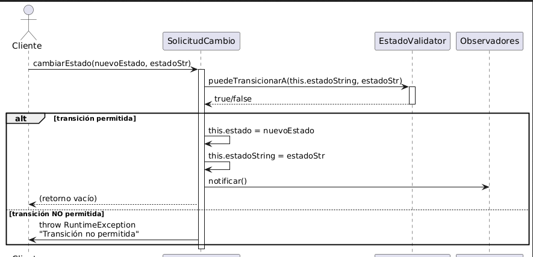
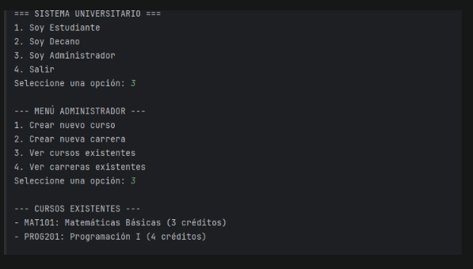

# CHICAS-SUPERPODEROSAS-_BACK
Intregrantes:
- Valeria Bermúdez Aguilar 
- Juan Andrés Suárez Fonseca 
- Samuel Leonardo Albarracín Vergara 
- Carlos David Astudillo Castiblanco 
- Ana Gabriela Fiqutiva Poveda
## Repositorio: 
- BackEnd : https://github.com/AnaFiquitiva/CHICAS-SUPERPODEROSAS-_BACK.git
- Tablero Jira: https://lc5.atlassian.net/jira/software/projects/SCRUM/boards/1/backlog?epics=visible&issueParent=0&selectedIssue=SCRUM-15&atlOrigin=eyJpIjoiNmJlZWYzMDVhZjhhNGRmOTk0ODExNjQ5NjVkOTRlOGYiLCJwIjoiaiJ9
- Documento de Requerimientos: https://docs.google.com/document/d/1QQTtvrpe3ckFsEVrEOXLoOOKtfOTOchyWGx3rIJgM5g/edit?usp=sharing
- Documento de de Arquitectura Back: https://docs.google.com/document/d/1qRB4X-avn5bgg7-FGpukmTu5wqMt_NLhz4XO49avYmM/edit?usp=sharing

## Patrones de Diseño Utilizados

### 1. **Patrón Factory Method_Creacional**
- **Ubicación**: `UsuarioFactory.java`
- **Descripción**: El patrón **Factory Method** se utiliza en la clase `UsuarioFactory` para crear instancias de diferentes
tipos de usuarios (como `Estudiante`, `Administrador`, `Decanatura`). Este patrón centraliza la creación de objetos, lo que facilita la expansión 
del sistema sin tener que modificar el código existente. Cuando se agregan nuevos tipos de usuarios, solo es necesario añadir un nuevo método en la 
factory para crearlo.

### 2. **Patrón Observer_Comportamental**
- **Ubicación**: `Usuario.java`, `Administrador.java`, `Estudiante.java`
- **Descripción**: El patrón **Observer** está implementado a través de la interfaz `Observador`, que es implementada por las clases `Usuario` y sus 
subclases. Esto permite que los objetos (como `Estudiante` o `Administrador`) reciban notificaciones de cambios en el estado del sistema, como el 
estado del semáforo de un estudiante.
    
### 3. **Patrón Strategy_Comportamental**
- **Ubicación**: `Administrador.java`, `Estudiante.java`
- **Descripción**: Aunque no es evidente de inmediato, las clases `Administrador` y `Estudiante` sobrescriben métodos como `actualizar()`, lo que puede 
estar indicando el uso de un patrón **Strategy**. Este patrón permite que un objeto cambie su comportamiento en tiempo de ejecución según el tipo de usuario, 
lo que es útil para mantener la flexibilidad y escalabilidad del sistema.

---

## Principios SOLID Aplicados

### 1. **Responsabilidad Única (SRP)**
Las clases están bien estructuradas, de manera que cada una tiene una única responsabilidad. Por ejemplo:
- `Usuario.java` se encarga de la autenticación y gestión de los atributos comunes de los usuarios.
- `Administrador.java` gestiona las tareas y notificaciones relacionadas con los administradores.
- `Estudiante.java` maneja las actividades específicas de los estudiantes, como su historial académico y el estado del semáforo.

### 2. **Abierto/Cerrado (OCP)**
La implementación permite que las clases se extiendan sin necesidad de modificar las clases base. Por ejemplo, 
si se quiere agregar un nuevo tipo de usuario, solo es necesario extender la clase `Usuario` o agregar un nuevo método en factory, 
sin modificar las clases existentes.

### 3. **Sustitución de Liskov (LSP)**
Las subclases de `Usuario`, como `Administrador` y `Estudiante`, pueden sustituir a la clase base `Usuario` sin alterar el funcionamiento del sistema. 
Esto se debe a que las subclases mantienen el comportamiento esperado de la clase base, permitiendo la reutilización de la lógica.

### 4. **Interfaz Segregada (ISP)**
La interfaz `Observador` es un buen ejemplo de este principio. Las clases solo implementan los métodos que realmente necesitan. P
or ejemplo, `Usuario` implementa la interfaz `Observador` porque se espera que los usuarios reaccionen a las actualizaciones del sistema, 
pero no todos los usuarios tienen que implementar interfaces que no utilizarán.

### 5. **Inversión de Dependencias (DIP)**
Aunque no se observa explícitamente en cada clase, el uso de patrones como **Factory Method** y la separación de la creación de objetos en una clase 
independiente (como `UsuarioFactory`) promueve la inversión de dependencias, ya que las clases que consumen objetos de tipo `Usuario` no necesitan 
saber cómo se crean, solo cómo usarlos.

--- 
## Diagramas 

### 1. Diagrama de contexto 

### 2. Diagrama de Casos de Uso 
[Diagrama casos de uso ](docs/UML/Diagrama%20casos%20de%20uso.pdf)
### 3. Diagrama de Clases 
[Diagrama de Clases](docs/UML/Proyecto%20DOSW_DiagramaClases.pdf)
### 3. Diagramas de Secuencia 

### 3. Diagrama de Base de Datos 
[DiagramadeBasesdeDatos](docs/UML/DiagramadeBasesdeDatos.pdf)

-- 
## Cobertura de Codigo y Analisis Estatico Implementado

## Ejemplo de Uso 

